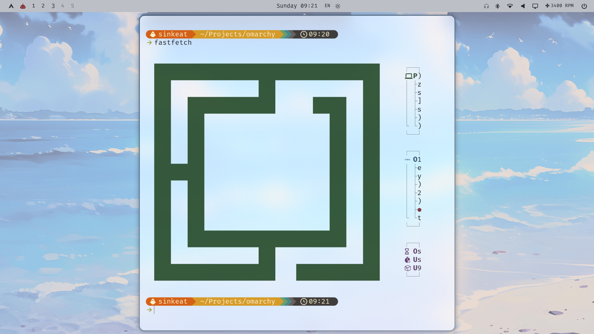
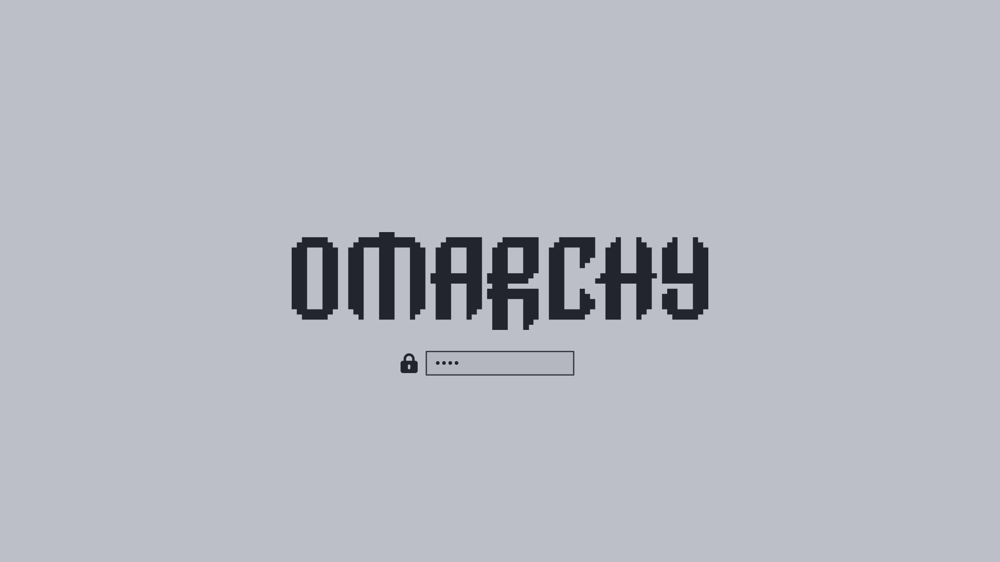

# Quicksilver

A soft silver light theme for [Omarchy](https://omarchy.org): graphite text, steel-blue accent, and glassy Ayaka-style windows.



## Install

```bash
omarchy theme install https://github.com/Ahmed-Sinkeat/omarchy-quicksilver-theme
```

This gives you the palette, wallpapers, icons and boot screen image.

### Full look (window style + glass terminals)

Omarchy drops `hyprland.lua` and terminal configs from themes installed from git, because they can run code. To get the rounded corners, gaps, shadows, blur, springy animations and see-through terminals, install it as a local theme instead. Read `hyprland.lua` first, it's short.

```bash
git clone https://github.com/Ahmed-Sinkeat/omarchy-quicksilver-theme ~/.config/omarchy/themes/quicksilver
rm -rf ~/.config/omarchy/themes/quicksilver/.git
omarchy theme set quicksilver
```

### Boot screen (optional)

```bash
omarchy plymouth set-by-theme quicksilver
```



## Palette

| Role | Color |
|---|---|
| Background | `#bcc0c6` |
| Foreground | `#22262c` |
| Accent | `#415f7d` |
| Selection | `#9ba1aa` |

All 8 normal terminal colors meet 4.5:1 contrast on the background.

## Credits

- Window animations adapted from the [Ayaka theme](https://github.com/abhijeet-swami/omarchy-ayaka-theme) (animations by Raze).
- Wallpapers are not mine. Sources as far as I could trace them:

| Wallpaper | Found in | Original artist |
|---|---|---|
| `01-dominik-mayer-6` | [orangci/walls-catppuccin-mocha](https://github.com/orangci/walls-catppuccin-mocha) | Dominik Mayer |
| `02-railroad-cat`, `03-salty-suburban`, `06-atlantis`, `07-beach`, `08-cartoon-castle` | [orangci/walls-catppuccin-mocha](https://github.com/orangci/walls-catppuccin-mocha) | unknown |
| `04-utiity`, `05-ign_lighthouse` | [linuxdotexe/nordic-wallpapers](https://github.com/linuxdotexe/nordic-wallpapers) | unknown (from Unsplash/Reddit, recolored with ImageGoNord) |

**Are you the artist of one of these?** Open an issue and I'll credit you properly or remove it.

## License

Theme config files are MIT (see `LICENSE`). Wallpapers belong to their respective creators and are not covered by that license.
